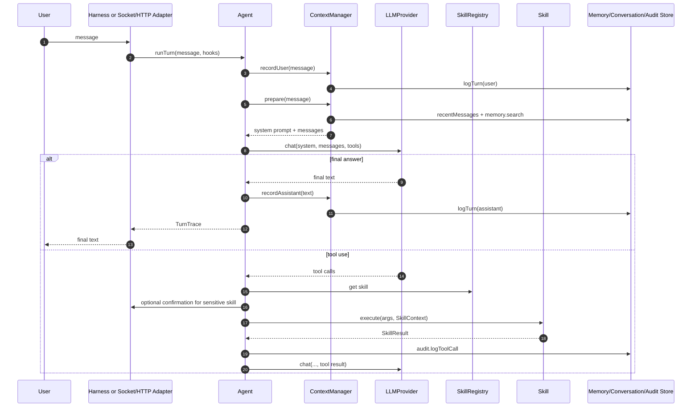
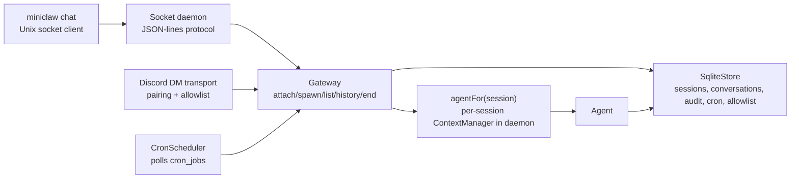
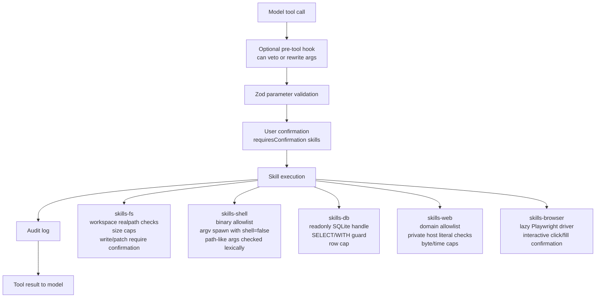
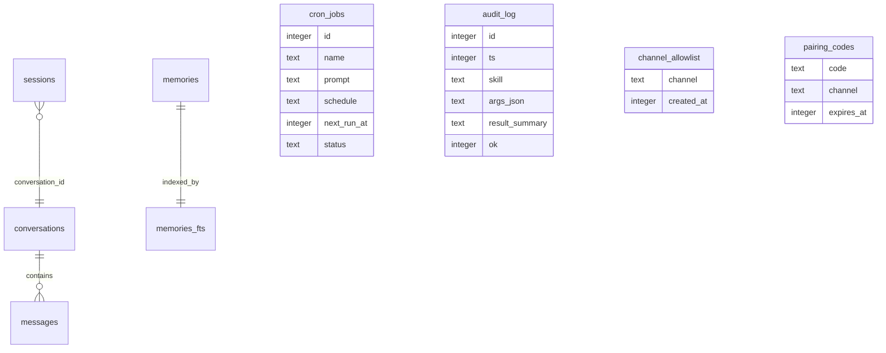

# Miniclaw Architecture

This document maps the current codebase at a package and runtime-flow level.

## Package Layers

```mermaid
flowchart TB
  core["@miniclaw/core<br/>interfaces and shared types"]

  agent["@miniclaw/agent<br/>tool loop and audit dispatch"]
  dreaming["@miniclaw/dreaming<br/>background reflection"]
  harness["@miniclaw/harness<br/>REPL/meta-command orchestration"]
  gateway["@miniclaw/gateway<br/>sessions, daemon socket, cron runner"]
  http["@miniclaw/io-http<br/>HTTP + SSE wrapper"]
  cli["@miniclaw/cli<br/>composition root"]

  contextStateless["@miniclaw/context-stateless"]
  contextWindowed["@miniclaw/context-windowed"]

  llmAnthropic["@miniclaw/llm-anthropic"]
  llmOpenAI["@miniclaw/llm-openai"]
  llmGemini["@miniclaw/llm-gemini"]

  memorySqlite["@miniclaw/memory-sqlite<br/>SQLite persistence"]
  memoryInmemory["@miniclaw/memory-inmemory"]
  memoryVector["@miniclaw/memory-vector"]

  skillsFs["@miniclaw/skills-fs"]
  skillsShell["@miniclaw/skills-shell"]
  skillsDb["@miniclaw/skills-db"]
  skillsMemory["@miniclaw/skills-memory"]
  skillsWeb["@miniclaw/skills-web"]
  skillsBrowser["@miniclaw/skills-browser"]
  skillsCron["@miniclaw/skills-cron"]
  skillsSessions["@miniclaw/skills-sessions"]
  skillsCanvas["@miniclaw/skills-canvas"]
  skillsTodo["@miniclaw/skills-todo"]

  discord["@miniclaw/transport-discord"]

  agent --> core
  dreaming --> agent
  dreaming --> core
  harness --> agent
  harness --> core
  gateway --> agent
  gateway --> core
  http --> agent
  http --> core

  contextStateless --> core
  contextWindowed --> core
  llmAnthropic --> core
  llmOpenAI --> core
  llmGemini --> core
  memorySqlite --> core
  memoryInmemory --> core
  memoryVector --> core

  skillsFs --> core
  skillsShell --> core
  skillsDb --> core
  skillsMemory --> core
  skillsWeb --> core
  skillsBrowser --> core
  skillsCanvas --> core
  skillsTodo --> core
  skillsCron --> core
  skillsCron --> gateway
  skillsSessions --> core
  skillsSessions --> gateway

  discord --> core
  discord --> gateway

  cli --> agent
  cli --> dreaming
  cli --> harness
  cli --> gateway
  cli --> contextStateless
  cli --> contextWindowed
  cli --> llmAnthropic
  cli --> llmOpenAI
  cli --> llmGemini
  cli --> memorySqlite
  cli --> memoryInmemory
  cli --> skillsFs
  cli --> skillsShell
  cli --> skillsDb
  cli --> skillsMemory
  cli --> skillsWeb
  cli --> skillsCron
  cli --> skillsSessions
  cli --> skillsCanvas
  cli --> discord
```

## Interactive Turn Flow

## Daemon And Transports

Notes:

- In daemon mode, `agentFor(session)` creates a `WindowedContextManager` bound to the session conversation id.
- In REPL mode, `sessions_*` skills currently use a gateway whose `agentFor` returns the same CLI agent/context for all sessions, so session isolation is weaker there than in daemon mode.
- The daemon starts `CronScheduler`, but the current daemon skill registry only adds `sessions_*`; it imports but does not register `cron_*` or `canvas_*`.

## Skill Safety Gates

## Persistence Schema Areas

